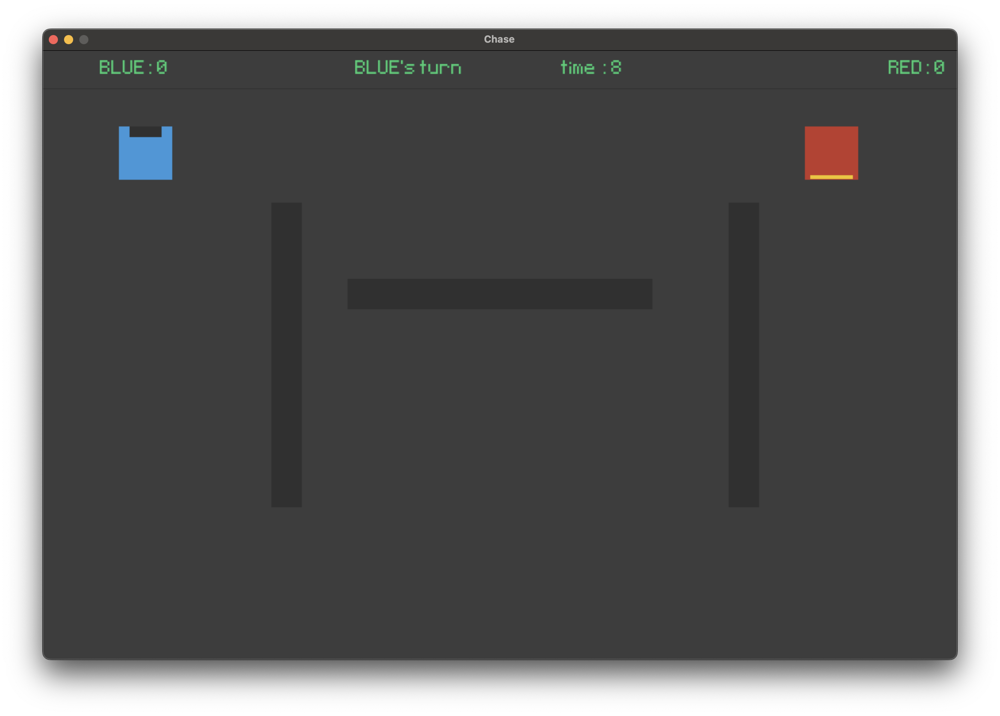

# Chase



## Overview
**Chase** is a fast-paced, two-player local game built with Python and Pygame. One player is the chaser, and the other is the runner. The goal is to outmaneuver your opponent in a maze-like arena filled with walls and obstacles. The game features custom pixel fonts and multiple map layouts.

## Features
- Two-player local gameplay (keyboard split)
- Dynamic chaser/runner role switching
- Multiple map layouts (see `maps.py`)
- Custom pixel font (Pixeltype.ttf)
- Colorful, retro-inspired visuals
- Score and timer system

## Installation
1. **Clone the repository:**
   ```bash
   git clone <repo-url>
   cd chase
   ```
2. **Install dependencies:**
   ```bash
   pip install pygame numpy
   ```

## How to Play
- Run the game:
  ```bash
  python chase.py
  ```
- The game window will open. Two players use the keyboard to control their characters.

### Controls
- **RED Player** (Runner/Chaser):
  - Move: Arrow keys (↑, ↓, ←, →)
  - Skill: Right Ctrl (or Right Command for MacOs)
- **BLUE Player** (Runner/Chaser):
  - Move: W, A, S, D
  - Skill: Spacebar

### Objective
- The chaser tries to catch the runner within the time limit.
- If the chaser catches the runner or time runs out, roles switch and points are awarded.
- Navigate around walls and use your skill for a burst of speed (limited use per round).

## Assets
- **Font:** [Pixeltype.ttf](font/Pixeltype.ttf)
- **In-game screenshot:** See above or in `images/inGame.png`
- **Maps:** Defined in `maps.py`

## Requirements
- Python 3.7+
- [pygame](https://www.pygame.org/)
- [numpy](https://numpy.org/)

## License
MIT License (or specify your license here)

---
Enjoy the chase!
