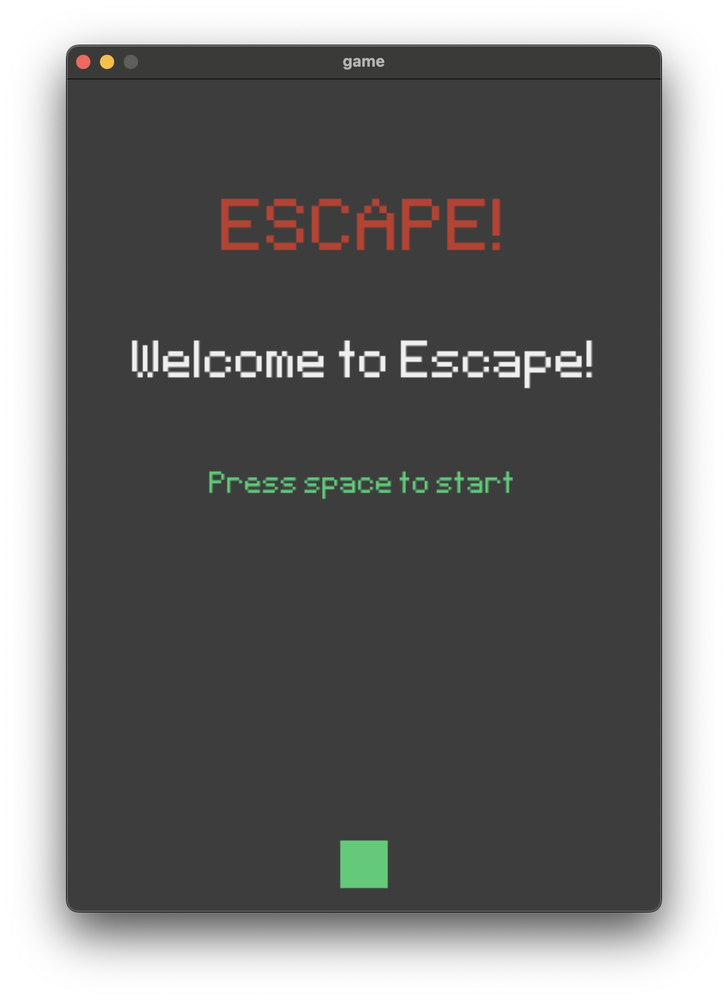

# Escape
A Escape game written in Python using the Pygame library.


## Installing
Download the Python 3 installer package from the official website and install it, if not installed previously.

Run the following in the terminal to install the required libraries
```
pip3 install -r requirements.txt
```


## Running the application
Download the source code from the repository and run the file just as any other Python script (.py) file.
```
python3 escape.py
```

The code is properly commented and self explanatory. Tweaks can be made to change the play style or visuals of the game.


## Screenshots

<p>Starting screen</p>


<p>Level 1</p>


<p>Level 2</p>


<p>Level 3</p>


<p>Level 4</p>


<p>Level 5</p>


<p>Game over screen</p>


<p>Congratulations screen</p>


## Prerequisites
* [Python](https://www.python.org)
* [Pygame](https://www.pygame.org/wiki/GettingStarted), an open source Python library for making multimedia applications
* [Numpy](https://numpy.org/)

## Authors

* **Abdullah Bilici**

## Acknowledgements
* [Pygame Documentations](https://www.pygame.org/docs/)