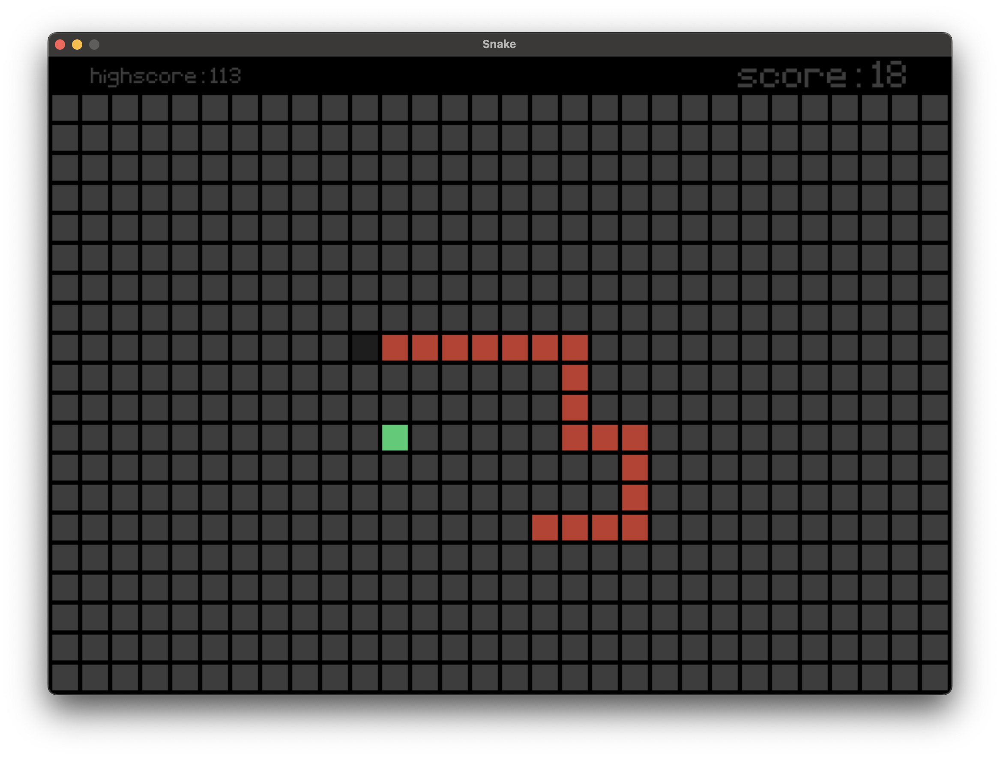

# Snake Game

A classic Snake game built with [Pygame](https://www.pygame.org/). Eat apples, grow your snake, and try to beat the high score!

<p align="center">
  
</p>

## Features
- Classic snake gameplay
- High score tracking (saved in `highscore.txt`)
- Retro pixel font (`font/Pixeltype.ttf`)
- Customizable board size and visuals

## Requirements
- Python 3.8+
- [Pygame](https://www.pygame.org/) (install with `pip install pygame`)

## How to Play
- Run the game:  
  ```bash
  python snake.py
  ```
- Use the arrow keys to control the snake.
- Eat the green apples to grow and increase your score.
- Avoid colliding with yourself!

## Creating an Executable
You can package the game as a standalone executable for Windows, macOS, or Linux using [PyInstaller](https://pyinstaller.org/):

### 1. Install PyInstaller
```bash
pip install pyinstaller
```

### 2. Build the Executable
Run the following command in the project directory:
```bash
pyinstaller --onefile --add-data "font/Pixeltype.ttf:font" --add-data "images/inGame.png:images" --add-data "highscore.txt:." snake.py
```
- On **Windows**, use a semicolon (`;`) instead of a colon (`:`) to separate source and destination in `--add-data`:
  ```bash
  pyinstaller --onefile --add-data "font/Pixeltype.ttf;font" --add-data "images/inGame.png;images" --add-data "highscore.txt;." snake.py
  ```
- On **macOS/Linux**, use a colon (`:`) as shown above.

The executable will be created in the `dist/` folder.

### 3. Run the Executable
- On **Windows**: Double-click `dist/snake.exe` or run it from the command prompt.
- On **macOS/Linux**: Run `./dist/snake` from the terminal.

## Notes
- The game uses a custom pixel font (`font/Pixeltype.ttf`).
- High scores are saved in `highscore.txt` in the project directory.
- If you want to reset the high score, delete or edit `highscore.txt`.

## License
This project is for educational and personal use. Feel free to modify and share!
